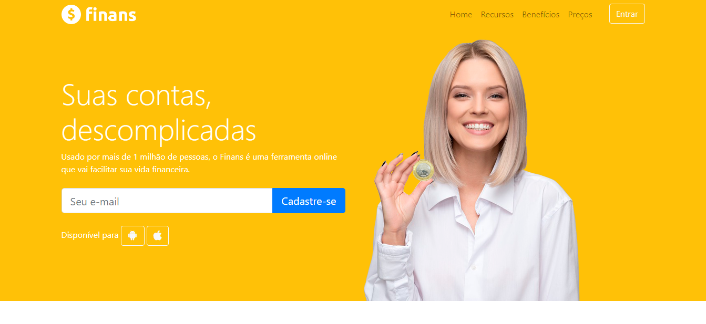

<h4 align="center">
    Finans - finanças pessoais
</h4>

  &nbsp;&nbsp;&nbsp;
  <a href="#dart-desafio">Desafio</a>&nbsp;&nbsp;&nbsp;|&nbsp;&nbsp;&nbsp;
  <a href="#computer-tecnologias">Tecnologias</a>&nbsp;&nbsp;&nbsp;

## :dart: Desafio
   Aplicação desenvolvida no curso Desenvolvimento Web Completo para a prática do framework Bootstrap 4 .
 
## :computer: Tecnologias 

- [HTML]()
- [CSS]()
- [BOOTSTRAP]()

    

Feito com :heart: by Yuri Corrêa :wave: [Contato](https://www.linkedin.com/in/yucorrea/)
